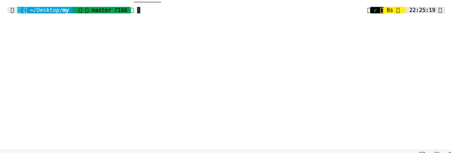

# Bash

One of my hardest projects
Of course, for the implementation of the bash, one person will not be enough,
and therefore we made this challenge shoulder to shoulder with my partner
We have implemented most of the general functionality that completely copies the behavior of bash
If I begin to describe what we have implemented in this project, then I simply will not have enough space :)
I recommend starting a project and trying the functionality of the program on your own experience

## Technologies

1. C
2. Make

## Launch

1. Build a project using Makefile

   ```sh
   $ make
   ```

2. Start the program, like this:

   ```sh
   $ ./minishell
   ```

## Show

  
